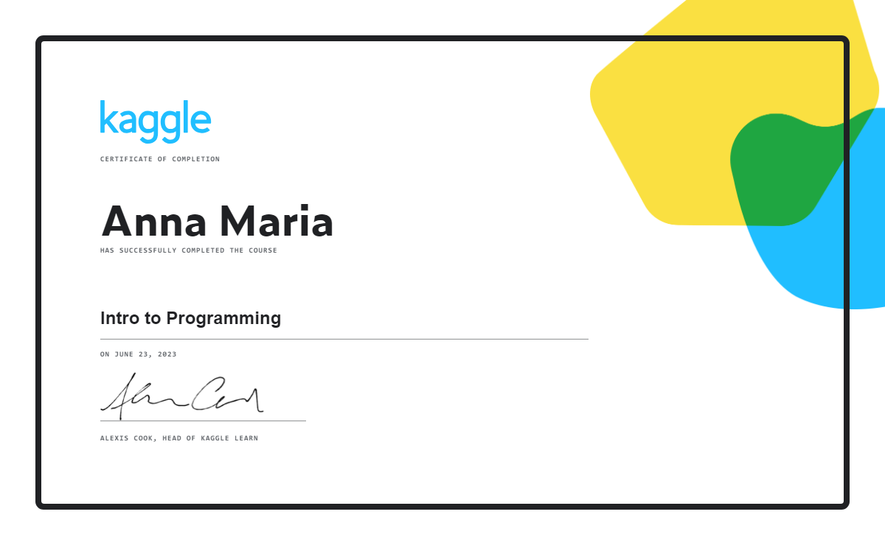
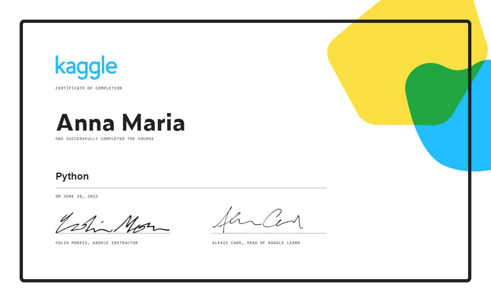

## 💻 Project

Learning python and machine learning on the kaggle platform.

## 📜 Certificates
#### 01 - Intro to Programming

  

#### 02 - Python

  

## ✨ Technologies

This project was developed with the following technologies:

- Python
